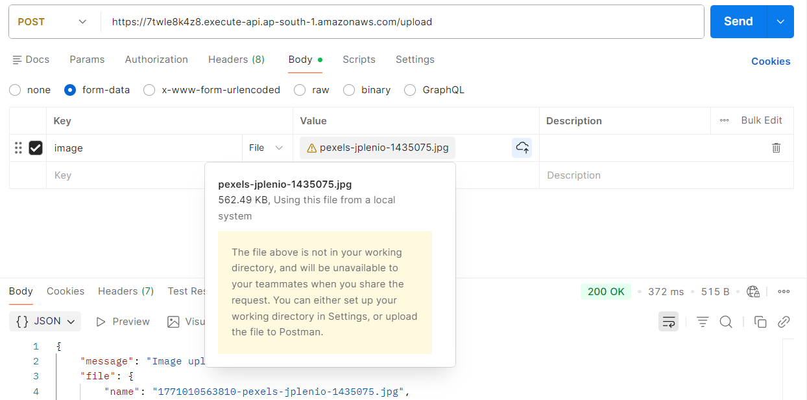
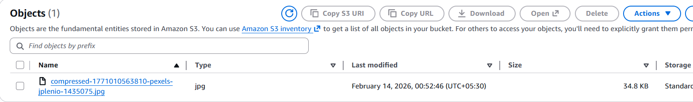

# AWS Serverless Image Compression Pipeline

A serverless, event-driven backend system that automatically compresses images uploaded via an Express.js endpoint or directly to an S3 bucket.

## 🚀 Features
- **Express.js on Lambda**: Single endpoint `POST /upload` for easy file uploads via Postman.
- **Automated Compression**: S3-triggered Lambda automatically compresses images when they land in the source bucket.
- **Sharp Processing**: High-performance image processing using `libvips` (Sharp).
- **Hybrid Handler**: A single code base handles both web requests and cloud events.
- **Smart Cleanup**: Automatically removes original images from the source bucket after successful compression.

## 🏗 Architecture
1. **User** sends an image to the API Gateway.
2. **Lambda (Express)** uploads the image to **Bucket A (Source)**.
3. **S3 Event** triggers **Lambda (Processor)**.
4. **Lambda** compresses the image and uploads it to **Bucket B (Destination)**.
5. **Lambda** deletes the original from **Bucket A**.

## 📂 Project Structure
```text
aws-serverless-image-compressor
│
├── lambda/
│   ├── index.js (Main Handler)
│   ├── server.js (Express App)
│   ├── processor.js (Compression Logic)
│   ├── package.json
│
├── infrastructure/
│   └── setup-notes.md (AWS Configuration Guide)
│
└── README.md
```

## � Performance Demonstration

Our pipeline achieves massive compression ratios by stripping metadata and using optimized encoders.

### 1. Uploading via Postman
A high-resolution image (~562 KB) is sent to the `/upload` endpoint.


### 2. Result in S3
The processed image in the destination bucket is reduced to only **34.8 KB**—a **93% reduction** in size!


## 🛠 Setup & Deployment
1. **S3 Buckets**: Create a Source and Destination bucket.
2. **Lambda**: Deploy the `lambda/` folder with `sharp` (installed for Linux).
3. **IAM**: Ensure Lambda has `s3:GetObject`, `s3:PutObject`, and `s3:DeleteObject` permissions.
4. **Environment Variables**:
   - `SOURCE_BUCKET`: Your raw bucket name.
   - `COMPRESSED_BUCKET`: Your destination bucket name.
   - `IMAGE_QUALITY`: Defaults to 80.
   - `RESIZE_WIDTH`: Defaults to 800.

## 🧪 Testing with Postman
1. Create a `POST` request to your API Gateway URL.
2. Under the **Body** tab, select **form-data**.
3. Add a key `image`, select a large JPG/PNG file.
4. Send the request and watch the magic happen in S3!

---
Developed as part of the AWS Serverless Image Compressor project.
